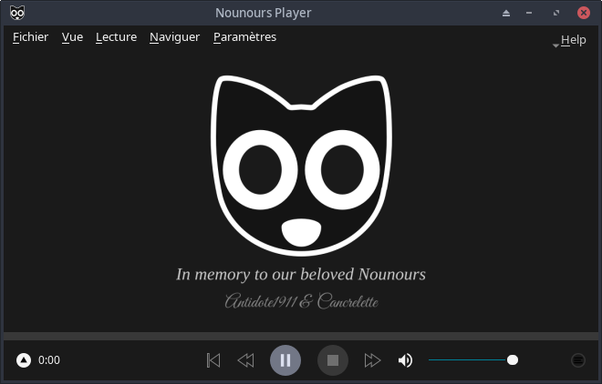

# Nounours Player

Un lecteur multimédia libre et open-source, multiplateforme, basé sur [libmpv](https://mpv.io/) et Qt6.

[](https://github.com/Antidote1911/Nounours-Player/actions/workflows/ci.yml)
[](LICENSE)



## Fonctionnalités

- Lecture de pratiquement tous les formats audio/vidéo via libmpv/FFmpeg
- Gestion de playlists avec modes aléatoire et répétition
- Support des gestes (glisser pour avancer/reculer, glisser pour régler le volume)
- Mode Lumières tamisées (X11)
- Fenêtre toujours au premier plan
- Capture d'écran
- Sélection des pistes de sous-titres et audio
- Raccourcis clavier configurables
- Vérificateur de mises à jour
- 13 langues : allemand, espagnol, français, croate, italien, géorgien, coréen, néerlandais, portugais brésilien, russe, turc, vietnamien, chinois (simplifié)

## Prérequis

- Qt 6.4+
- libmpv
- X11 (Linux)

## Compilation

```bash
cmake -B build -S src -DCMAKE_BUILD_TYPE=Release && cmake --build build -j$(nproc)
```

### Dépendances Linux (Ubuntu 24.04)

```bash
sudo apt-get install cmake ninja-build \
    qt6-base-dev qt6-base-private-dev libqt6svg6-dev \
    qt6-tools-dev qt6-tools-dev-tools qt6-l10n-tools \
    libmpv-dev libx11-dev libgl-dev pkg-config
```

### Windows (MSYS2 / MinGW-w64)

```bash
pacman -S --needed mingw-w64-x86_64-toolchain mingw-w64-x86_64-cmake \
    mingw-w64-x86_64-ninja mingw-w64-x86_64-qt6-base \
    mingw-w64-x86_64-qt6-svg mingw-w64-x86_64-qt6-tools \
    mingw-w64-x86_64-mpv mingw-w64-x86_64-libzip
```

## Installation (Linux)

```bash
cmake --install build
```

Installe dans `/usr/local` par défaut. Utilisez `-DCMAKE_INSTALL_PREFIX=/usr` pour une installation système.

## Licence

[GPL v2](LICENSE)
